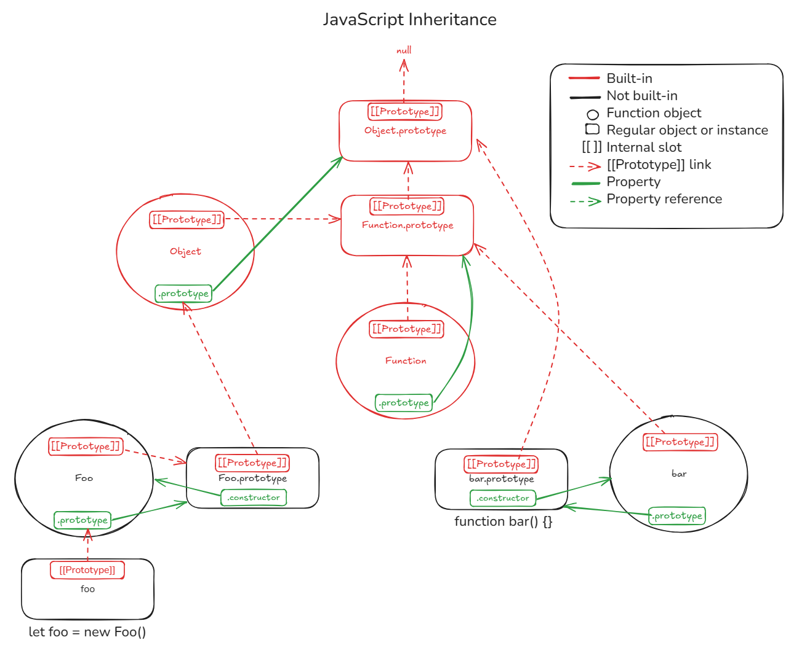

[← Back to Index](../index.md)

# JavaScript Cheat Sheet

---

## Basics

```js
let x = 10;           // block scoped (mutable)
const y = 20;         // block scoped (immutable)
var z = 30;           // function scoped — avoid if possible

typeof x;             // "number"
typeof null;          // "object" (legacy bug)
```

Falsy values: `false`, `0`, `''`, `null`, `undefined`, `NaN`

---

## Functions

```js
function sum(a, b) {
  return a + b;
}

const multiply = (a, b) => a * b;
```

- Functions are first-class values.
- Use `function` declarations for hoisting.
- Arrow functions **do not** bind their own `this`.

---

## Objects

```js
const user = {
  name: "Rafael",
  age: 41,
  speak() {
    console.log(`Hi, I'm ${this.name}`);
  }
};

user["name"];      // "Rafael"
user.speak();      // uses this
```

---

## Arrays

```js
const list = [1, 2, 3];

list.map(x => x * 2);       // [2, 4, 6]
list.filter(x => x > 1);    // [2, 3]
list.reduce((a, b) => a + b, 0); // 6
```

---

## Equality

```js
1 == "1";   // true      (type coercion)
1 === "1";  // false     (strict)
```

Always prefer `===` and `!==`

---

## Destructuring

```js
const [a, b] = [1, 2];
const { name, age } = user;
```

With defaults:

```js
const { lang = "en" } = settings;
```

---

## Spread & Rest

```js
const arr = [1, 2, 3];
const clone = [...arr];

function logAll(...args) {
  console.log(args);
}
```

---

## Classes & Inheritance

The `prototype` is king



Classes are just syntactic sugar

```js
class Animal {
  constructor(name) {
    this.name = name;
  }

  speak() {
    console.log(`${this.name} makes noise.`);
  }
}

class Dog extends Animal {
  speak() {
    console.log(`${this.name} barks.`);
  }
}
```

---

## Modules

```js
// Exporting
export function add(a, b) { return a + b; }
export default class Something { ... }

// Importing
import { add } from './math.js';
import Something from './thing.js';
```

Use `"type": "module"` in `package.json` to enable ESM.

---

## Promises & Async/Await

```js
async function fetchData() {
  const res = await fetch('/api');
  const data = await res.json();
  return data;
}

fetchData().then(console.log);
```

Handle errors with `try/catch` or `.catch()`.

---

## Error Handling

```js
try {
  throw new Error("Nope");
} catch (e) {
  console.error(e.message);
}
```

---

## Useful APIs

```js
Object.keys(obj);    // array of keys
Object.values(obj);  // array of values
Object.entries(obj); // [[key, value], ...]

Math.random();       // 0..1
Date.now();          // timestamp in ms
```

---

## Event Loop & Execution

- JS is **single-threaded** with an **event loop**
- `setTimeout(fn, 0)` runs *after* the current call stack
- Promises queue into the **microtask queue**

---

## Gotchas

- `typeof null === "object"` – legacy bug
- `NaN !== NaN` – use `Number.isNaN()`
- Array holes: `[,,]` is not `[undefined, undefined]`
- `this` behaves differently inside arrow functions

---

## Best Practices

- Avoid `var`, use `let` and `const`
- Never use `==` unless you truly want coercion
- Don’t mutate function arguments
- Use `Object.freeze()` for immutability
- Always `return` or `await` Promises
- Prefer arrow functions unless you need `this` or hoisting
- Avoid global scope pollution

---